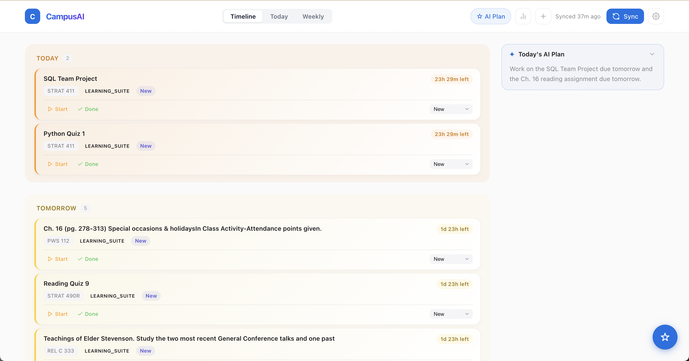
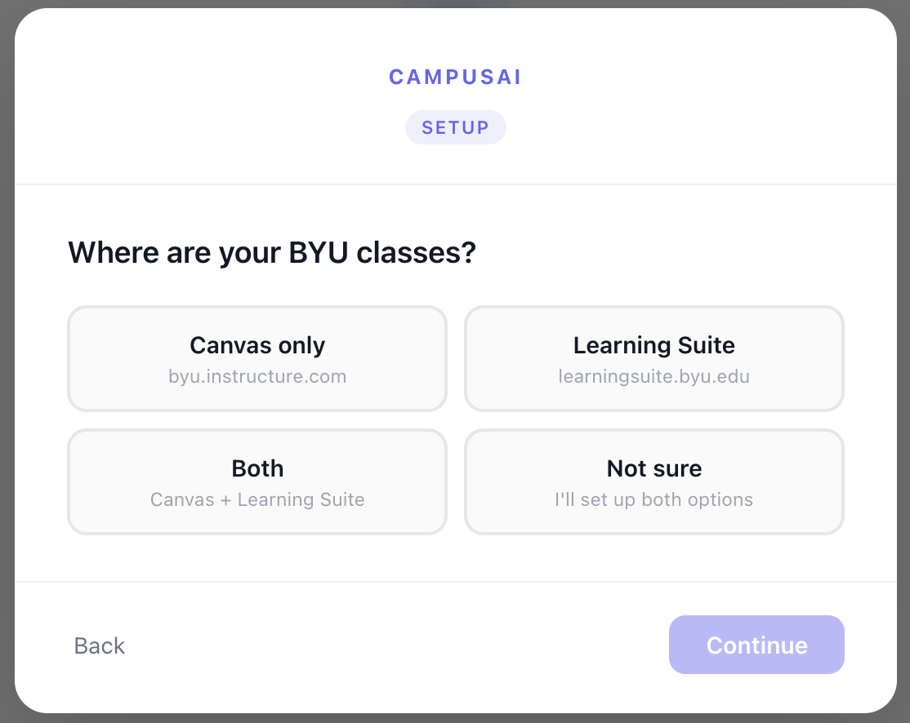
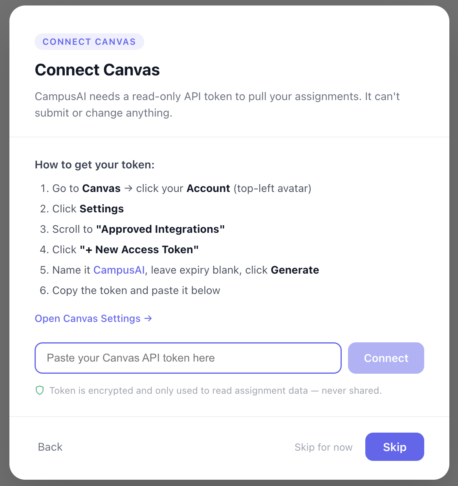
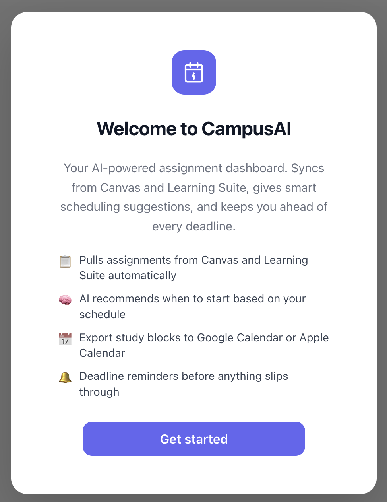
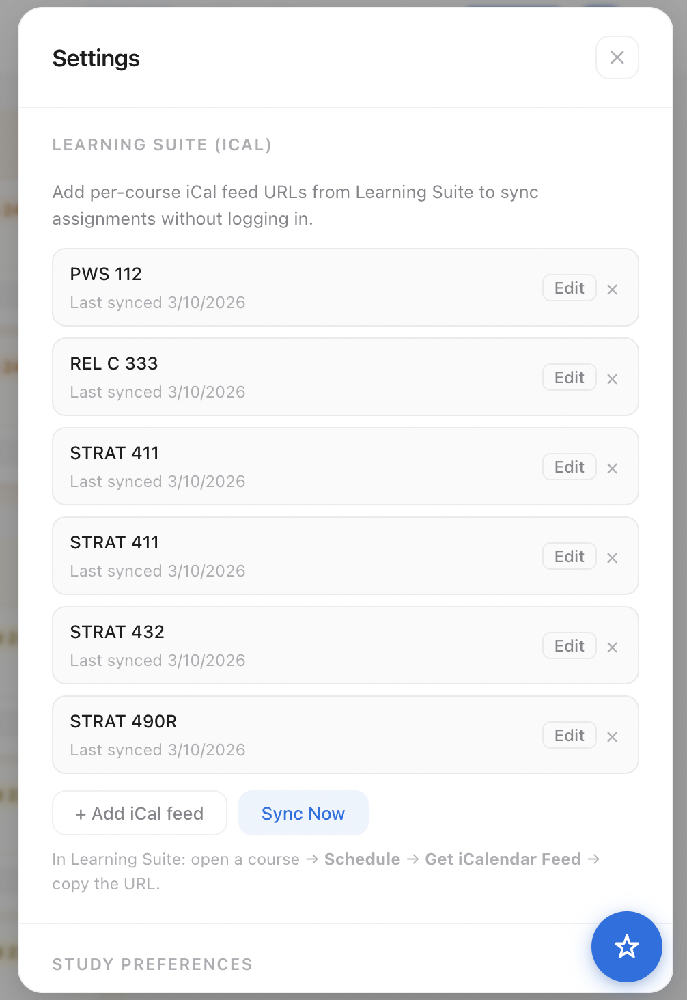

## Overview

**CampusAI** is an AI-powered scheduling assistant built for BYU students. It automatically pulls assignments from Canvas and Learning Suite into a single unified dashboard, then uses AI to build a personalized, prioritized study plan — so students stop wasting time deciding what to work on and actually get things done.

### Core Features
- **Unified assignment sync** — connects to both Canvas (REST API) and Learning Suite (iCal feeds), pulling all deadlines into one place automatically
- **AI-generated study plans** — Groq-powered AI scores every assignment by priority, estimates time required, and suggests when to start
- **Smart scheduling** — accounts for the student's class schedule, preferred study times, and work style (spread-out vs. batch)
- **Calendar export** — accepted plans export directly to Google Calendar or download as an .ics file
- **Live AI chat** — streaming assistant that re-prioritizes your week mid-semester when life gets in the way

## Live Product

```{=html}
<div class="d-flex justify-content-center gap-3 my-4 flex-wrap">
  <a class="btn btn-primary d-inline-flex align-items-center"
     href="https://campusai-six.vercel.app"
     target="_blank" rel="noopener"
     aria-label="Open live app">
    <i class="fa-solid fa-window-restore me-2" aria-hidden="true"></i>
    Open App
  </a>

  <a class="btn btn-outline-dark d-inline-flex align-items-center"
     href="https://github.com/tyjones7/AISchedulingAssistant"
     target="_blank" rel="noopener"
     aria-label="View source on GitHub">
    <i class="fa-brands fa-github me-2" aria-hidden="true"></i>
    View on GitHub
  </a>

  <a class="btn btn-outline-secondary d-inline-flex align-items-center"
     href="https://github.com/tyjones7/AISchedulingAssistant/blob/main/docs/product-spec.md"
     target="_blank" rel="noopener"
     aria-label="Read product spec">
    <i class="fa-solid fa-file-lines me-2" aria-hidden="true"></i>
    Product Spec
  </a>
</div>
```

## Screenshots

```{=html}
<div class="row g-3 my-2">

  <div class="col-12">
    <figure class="figure w-100">
      
      <figcaption class="figure-caption text-center">
        Main dashboard — assignments from all courses grouped by due date, with Today's AI Plan in the sidebar
      </figcaption>
    </figure>
  </div>

  <div class="col-md-4">
    <figure class="figure w-100">
      
      <figcaption class="figure-caption text-center">
        Welcome screen — clear value prop before any setup required
      </figcaption>
    </figure>
  </div>

  <div class="col-md-4">
    <figure class="figure w-100">
      
      <figcaption class="figure-caption text-center">
        Class source step — onboarding adapts based on which platforms the student uses
      </figcaption>
    </figure>
  </div>

  <div class="col-md-4">
    <figure class="figure w-100">
      
      <figcaption class="figure-caption text-center">
        Canvas connect — inline instructions eliminate the need for external documentation
      </figcaption>
    </figure>
  </div>

  <div class="col-md-6">
    <figure class="figure w-100">
      
      <figcaption class="figure-caption text-center">
        Settings — 6 Learning Suite courses connected via iCal, each with last-synced timestamp
      </figcaption>
    </figure>
  </div>

</div>
```

## Product Specification

**Job to be Done:** Help overwhelmed students turn messy assignment lists into a real, optimized, auto-updating plan — so they feel in control, avoid last-minute stress, and perform better academically.

**Ideal Customer:** Emily Carter — a 20-year-old BYU sophomore/junior taking 5–6 courses, active in clubs, possibly working part-time. Already uses Canvas and Learning Suite but feels her system is barely holding together.

### MoSCoW-Prioritized User Stories

```{=html}
<div class="table-responsive my-3">
<table class="table table-bordered align-middle">
  <thead class="table-dark">
    <tr>
      <th style="width:130px">Priority</th>
      <th>User Story</th>
      <th>Why It Matters</th>
    </tr>
  </thead>
  <tbody>
    <tr>
      <td><span class="badge bg-danger">Must Have</span></td>
      <td><strong>Assignment aggregation</strong> — Canvas + Learning Suite in one place</td>
      <td>Zero value without this; students can't plan what they can't see</td>
    </tr>
    <tr>
      <td><span class="badge bg-danger">Must Have</span></td>
      <td><strong>AI-generated study plan</strong> — prioritized, time-estimated, personalized</td>
      <td>Core differentiator from a plain calendar app</td>
    </tr>
    <tr>
      <td><span class="badge bg-warning text-dark">Should Have</span></td>
      <td><strong>Assignment status tracking</strong> — mark in-progress, submitted, unavailable</td>
      <td>Without this the AI plan degrades fast and becomes noise</td>
    </tr>
    <tr>
      <td><span class="badge bg-warning text-dark">Should Have</span></td>
      <td><strong>Personalized onboarding</strong> — complete setup in under 5 minutes</td>
      <td>Users churn before experiencing value if setup is painful</td>
    </tr>
    <tr>
      <td><span class="badge bg-info text-dark">Could Have</span></td>
      <td><strong>AI chat for mid-week re-planning</strong> — adjust the plan when life changes</td>
      <td>High retention value, but core plan feature works without it</td>
    </tr>
  </tbody>
</table>
</div>
```

### Success Metrics

```{=html}
<div class="table-responsive my-3">
<table class="table table-sm table-bordered">
  <thead class="table-secondary">
    <tr><th>Metric</th><th>Target</th></tr>
  </thead>
  <tbody>
    <tr><td>Assignments synced on first use</td><td>≥ 20 per user</td></tr>
    <tr><td>AI plan generated and applied</td><td>≥ 60% of active users</td></tr>
    <tr><td>Day-7 retention</td><td>≥ 40% of signups</td></tr>
    <tr><td>Onboarding completion rate</td><td>≥ 75%</td></tr>
    <tr><td>Sync error rate</td><td>&lt; 5% of attempts</td></tr>
  </tbody>
</table>
</div>
```

```{=html}
<div class="d-flex justify-content-center my-3">
  <a class="btn btn-outline-primary d-inline-flex align-items-center"
     href="https://github.com/tyjones7/AISchedulingAssistant/blob/main/docs/product-spec.md"
     target="_blank" rel="noopener">
    <i class="fa-solid fa-arrow-up-right-from-square me-2" aria-hidden="true"></i>
    Read Full Product Spec
  </a>
</div>
```

## User Feedback

I tested CampusAI with BYU students across different majors and class loads. Here's what I learned.

### What Worked

**The aggregation was immediately valuable.** Every tester's first reaction to seeing their Canvas and Learning Suite assignments in one list was relief. One student said *"I didn't realize how much mental energy I was spending just keeping track of where everything lived."* The unified view alone felt worth the setup.

**The AI plan surfaced things people had mentally buried.** Several testers noticed the AI flagged assignments they had been unconsciously avoiding. The priority score gave them "permission" to deprioritize low-stakes tasks and focus on what actually mattered that week.

**Onboarding was smoother than expected.** Testers completed setup in 3–4 minutes once they knew where to find their iCal URLs. Inline step-by-step instructions significantly reduced confusion compared to the first version, which pointed users to external documentation.

### What Needs Work

**The Canvas token step created hesitation.** The most common friction point was uncertainty about what data was being accessed. Students wanted to understand exactly what the token could read before sharing it. Adding a clear "read-only, no submission access" explanation reduced drop-off in later testing.

**The AI over-weighted due dates and under-weighted effort.** A few testers felt the plan treated a 20-page paper and a 10-question quiz identically if their due dates were the same. Future iterations should let students flag estimated effort at assignment creation, or let the AI infer it from assignment type and point value.

**Status updates require a habit change.** The app works best when students mark assignments as submitted, but most testers forgot to do this consistently. The AI would resurface already-done work as urgent the next day. A prompt when a due date passes ("Did you finish this?") could close this loop automatically.

### Key Takeaway

The core loop — sync, plan, work, update — works. The biggest barriers to retention are the trust gap at onboarding (sharing credentials) and the friction of keeping assignment statuses current. Future iterations should focus on making status updates feel automatic rather than a manual chore.

## Technical Details

**Role:** Solo developer (full-stack)
**Stack:** React + Vite · FastAPI · Supabase PostgreSQL · Groq LLaMA · Deployed on Vercel + Render

### Key Technical Decisions

**iCal over Selenium for Learning Suite** — Learning Suite exposes per-course iCal feeds that don't require Duo MFA or a browser session. Parsing these with the `icalendar` Python library is fast, stateless, and works in any deployment environment — no headless Chrome needed.

**Groq LLaMA for AI** — Used two models for different tasks: `llama-3.3-70b-versatile` for chat and daily briefings (quality matters), `llama-3.1-8b-instant` for batch priority scoring (speed matters more). Responses stream over SSE so the interface feels responsive even for longer answers.

**Supabase Row Level Security** — All data is scoped per user at the database level, not just in application code. A bug in the backend cannot leak one student's assignments to another.

**Per-user Canvas tokens** — Canvas personal access tokens are stored encrypted per user in Supabase, so multiple students can use the app simultaneously with their own Canvas accounts.
